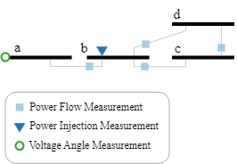
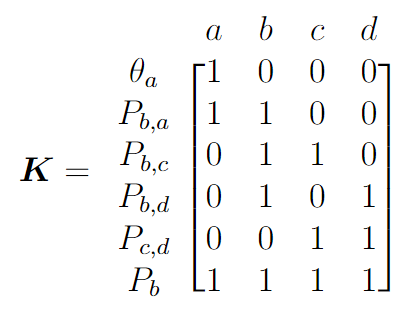
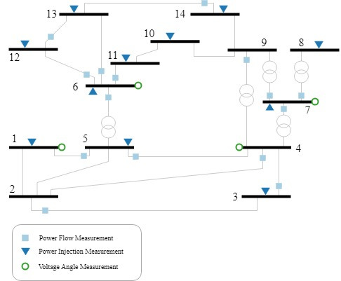
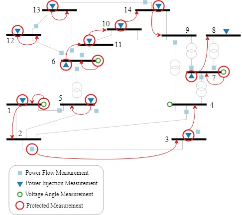

# Code Breakdown
In this passage, we will break down the steps to code the algorithm of the paper entitled "Measurement Protection to Prevent Cyber-Physical Attacks against Power System State Estimation", available on the following [link](https://www.sciencedirect.com/science/article/abs/pii/S1874548223000562).

## Summary
A generalized Integer Linear Programming (ILP) formulation of the resource allocation problem is proposed. The algorithm selects an optimal subset of measurements to be protected so the grid would be protected in its entirety. The ILP approach requires information about the structure of the network and does not rely on power flow equations. The approach applies to both linear and nonlinear State Estimation (SE), has low complexity, does not require problem reduction techniques for larger networks, and is easily customizable to include different types of measurement units and use in different applications.

## Base Formulation
The optimization problem boils down to the following:

$`
\begin{align}
     \text{Minimize } \sum_{m} (PC_m * w_m) \\
     \text{Subject to} \\
     \sum_{m} L_{m,i} \geq 1   \qquad \forall \; i \\
     \sum_{i} (K_{m,i}*L_{m,i}) = w_m   \qquad \forall \; m \\
     w_{m_p} + \sum_{m_f}(w_{m_f} * K_{m_f,i}) < \sum_i K_{m_p,i} \qquad \forall \; m_p \\
     \sum_{m_t} w_{m_t} \geq 1
\end{align}
`$

We will first break down the equations and notations, one by one, then see how they are implemented in GAMS. Initially, the types of measurements considered in this paper are the following:
1. Active power injection measurements (index $m_p$)
2. Active power flow measurements (index $m_f$)
3. Voltage phase angle measurements (index $m_t$)

In GAMS, these are defined as follows (for the IEEE 14-bus system):
```GAMS
Sets
     m  meas    / z00*z29 /
     pi(m) /z00*z10 /
     pf(m) /z11*z25 /
     t(m)  /z26*z29 /
     i  index    / i00*i13 /
  Alias (i,i2);
```
`m` is the total number of measurements, which is $30$ because the grid has to be fully observable; `pi` represents the power injection measurements, `pf` represents the power flow measurements, and `t` represents the angle measurements (or theta measurements). Finally, `i` represents the number of nodes in the IEEE 14-bus system.

The rest of the header of the code is the following:
```GAMS
Binary Variable w(m), y(m,i);
Free Variable z;
```
We note that `y` in GAMS represents $L$ in the paper, simply because we did not want to confuse $L$ with less equal or `.L` from GAMS; `w` and `y` (or $L$) will be defined in the following, and `z` is a free variable because it represents the objective function.

### Definition 1:
We define an $M \times N$ binary matrix $\mathbf{K}$ that relates the measurements, having an index $m$, to the state variables, having an index $i$, where $M$ is the total number of measurements in the system and $N$ is the number of nodes. Thus, the rows represent the measurements and the columns represent the nodes. The entries of the $\mathbf{K}$ matrix are assigned as follows: (this corresponds to Equation (8) in the paper)

$`
K_{m,i} = \left\{
    \begin{array}{ll}
        1 \text{, if $h_m(\mathbf{x})$ is a function of $x_i$} \\
        0 \text{ otherwise}
    \end{array}
\right. 
`$

Consider the arbitrary 4-node partial network, as a demonstrative exmaple, shown in the below figure. The phase angle reference is assumed to be outside of this network, thus $N=4$.



The $\mathbf{K}$ matrix for the arbitray 4-bus system would be the following:



For the IEEE 14-bus system, shown in the figure below, the GAMS representation is the following:



```GAMS
Table K(m,i)
          i00     i01     i02     i03     i04     i05     i06     i07     i08     i09     i10     i11     i12     i13
z00       1       1       0       0       1       0       0       0       0       0       0       0       0       0
z01       0       1       1       1       0       0       0       0       0       0       0       0       0       0
z02       1       1       0       1       1       1       0       0       0       0       0       0       0       0
z03       0       0       0       0       1       1       0       0       0       0       1       1       1       0
z04       0       0       0       1       0       0       1       1       1       0       0       0       0       0
z05       0       0       0       0       0       0       1       1       0       0       0       0       0       0
z06       0       0       0       0       0       0       0       0       1       1       1       0       0       0
z07       0       0       0       0       0       1       0       0       0       1       1       0       0       0
z08       0       0       0       0       0       1       0       0       0       0       0       1       1       0
z09       0       0       0       0       0       1       0       0       0       0       0       1       1       1
z10       0       0       0       0       0       0       0       0       1       0       0       0       1       1

z11       1       0       0       0       1       0       0       0       0       0       0       0       0       0
z12       0       1       1       0       0       0       0       0       0       0       0       0       0       0
z13       0       1       0       1       0       0       0       0       0       0       0       0       0       0
z14       0       0       1       1       0       0       0       0       0       0       0       0       0       0
z15       0       0       0       1       1       0       0       0       0       0       0       0       0       0
z16       0       0       0       1       0       0       1       0       0       0       0       0       0       0
z17       0       0       0       1       0       0       0       0       1       0       0       0       0       0
z18       0       0       0       0       1       1       0       0       0       0       0       0       0       0
z19       0       0       0       0       0       1       0       0       0       0       1       0       0       0
z20       0       0       0       0       0       1       0       0       0       0       0       1       0       0
z21       0       0       0       0       0       1       0       0       0       0       0       0       1       0
z22       0       0       0       0       0       0       1       1       0       0       0       0       0       0
z23       0       0       0       0       0       0       1       0       1       0       0       0       0       0
z24       0       0       0       0       0       0       0       0       0       0       0       1       1       0
z25       0       0       0       0       0       0       0       0       0       0       0       0       1       1

z26       1       0       0       0       0       0       0       0       0       0       0       0       0       0
z27       0       0       0       1       0       0       0       0       0       0       0       0       0       0
z28       0       0       0       0       0       1       0       0       0       0       0       0       0       0
z29       0       0       0       0       0       0       1       0       0       0       0       0       0       0;
```

### Definition 2:
We introduce the term _cover_ to refer to the relationship between a variable and the protected measurement securing it. Protecting measurement $m$ secures a single state variable $i$, if and only if the corresponding entry in the $\mathbf{K}$ matrix, $K_{m,i}$, is $1$. We thus define an $M \times N$ binary matrix $\mathbf{L}$, of dependent variables, such that:

$`
L_{m,i} = \left\{
    \begin{array}{ll}
        1 \text{, if $x_i$ is \textit{covered} by $h_m(\mathbf{x})$} \\
        0 \text{ otherwise}
    \end{array}
\right.
`$

To ensure that each state variable is _covered_ at least once, for full observability, the following constraint must be satisfied: 

$`
\sum_{m} L_{m,i} \geq 1   \qquad \forall \; i
`$

In the original paper, we refer to the previous equation as Equation (10). In GAMS, it can be represented as follows:
``` gams
Eq10(i).. sum(m,y(m,i)) =G= 1;
```

### Definition 3:
We define an $M \times 1$ vector $\mathbf{w}$, of decision variables, such that:

$`
w_m = \left\{
    \begin{array}{ll}
        1 \text{, if measurement $m$ is protected} \\
        0 \text{ otherwise}
    \end{array}
\right.
`$

For a protected measurement to _cover_ a single state variable, the following constraint must be satisfied:

$`
\sum_{i} (K_{m,i}*L_{m,i}) = w_m   \qquad \forall \; m
`$

Which is represented as follows:
``` gams
Eq12(m).. sum(i,K(m,i)*y(m,i)) =E= w(m);
```

If a given node has a power injection measurement in addition to power flow measurements on all lines leaving it, the equations corresponding to these measurements are not independent. To guarantee that not all these measurements are chosen to be protected simultaneously, the following condition is needed:

$`
    w_{m_p} + \sum_{m_f}(w_{m_f} * K_{m_f,i}) < \sum_i K_{m_p,i} \qquad \forall \; m_p
`$

Which is represented as follows:
``` gams
Eq13(pi,i).. sum (pf, w(pf)*K(pf,i)) + w(pi) =L= sum (i2, K(pi,i2));
```
In the case of an external voltage angle reference, we need at least one phase angle measurement in order to have the values of the phase angles and not only the phase angle differences. Thus, the following additional constraint is required to make sure that the correct phase angles are calculated:

$`
    \sum_{m_t} w_{m_t} \geq 1
`$

Which is represented as follows:
``` gams
Eq14.. sum(t, w(t)) =G= 1;
```

The objective function reflects the need to minimize the cost of measurement protection:

$$
\sum_{m} (PC_m * w_m)
$$
where $PC_m$ is the Protection Cost of securing the measurement $z_m$. 

Which is represented as follows; we first consider equal costs, i.e., $PC_m=1$
``` gams
OF.. sum(m,w(m)) =E= z;
```
The complete code for the base scenario is provided in this repository. Simulating the code would result in the following measurements to be protected:

 

We note that problem is overdetermined (because the grid is fully observable), thus there is not a unique solution; there are multiple optimal solutions especially for the simple base scenario.

## Other Scenarios
### Scenario II: Partial Grid Protection:
We assume that we have a partial grid to be protected, which, conversely, translates to having a limited protection budget.

### Scenario III: Zero-Injection Buses:
We assume that the grid has Zero-Injection Buses (ZIBs). These ZIBs do not have any load or generation, thus can be considered already protected. The overall number of measurements to be protected would thus be less than that of the base scenario.

### Scenario IV: Multi-measurement Units:
We account for measurement devices that measure multiple quantities at the same time. For example, Phasor Measurement Units (PMUs) measure the phase angle at the node and the power flows on all outgoing lines.

### Scenario V: Extending the Formulation to Other SE Formulations:
We extend the formulation to include AC SE and/or hybrid SE. Since the proposed ILP approach does not depend on the equations, the additional SE formulations can be easily implemented, if one accounts for the types of the measurements.
